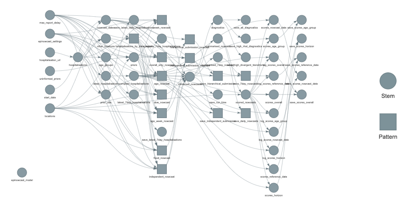

```{r setup, include=FALSE}
knitr::opts_chunk$set(
  echo = TRUE, eval = TRUE,
  fig.width = 9, fig.height = 9,
  dpi = 320,
  fig.path = "figures/"
)
```

## Authors

S. Abbott (1), S. Funk (1)

Correspondence to: sam.abbott@lshtm.ac.uk

## Affiliations

1. Center for the Mathematical Modelling of Infectious Diseases, London School of Hygiene & Tropical Medicine, London WC1E 7HT, United Kingdom

## Overview

This analysis uses the `targets` package for reproducibility. The full analysis structure can be seen below:

```{r, message = FALSE, eval = FALSE}
library(targets)
tar_glimpse()
```



## References

<div id = 'refs'></div>
